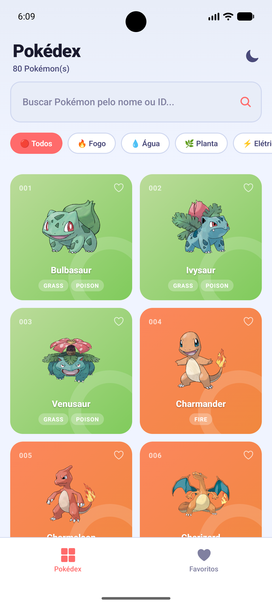
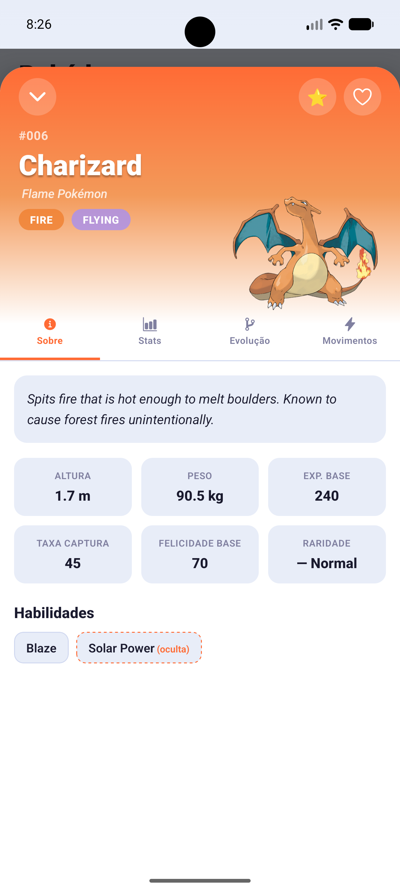
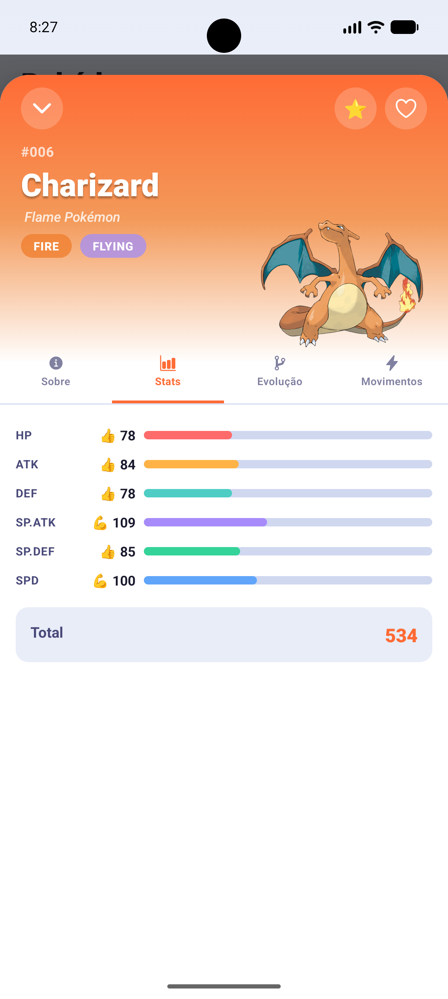
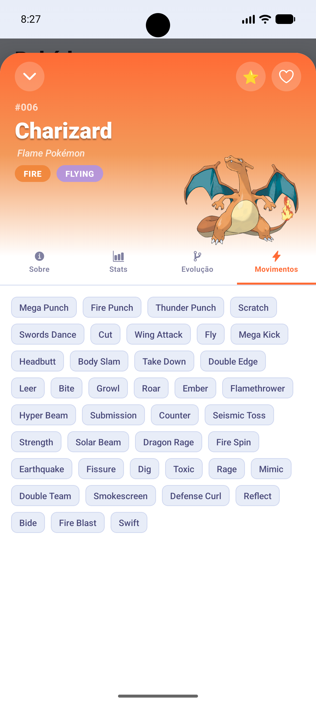
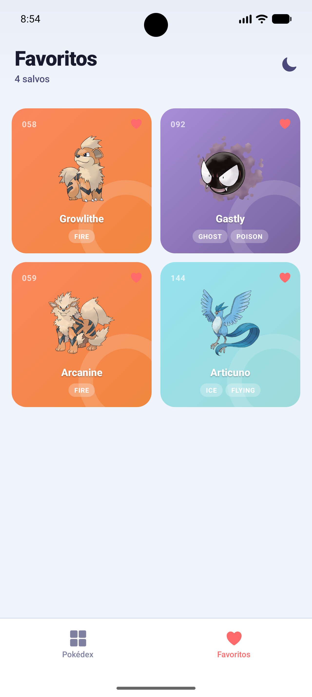

# 🎮 Pokédex - React Native

Um aplicativo mobile moderno e intuitivo para explorar informações detalhadas sobre Pokémon. Desenvolvido com React Native e Expo, oferece uma experiência fluida com tema escuro/claro, busca avançada e lista de favoritos.

## 📸 Screenshots

|  |  |  |
|------|--------|----------|
|  |  |  |

|  |  |  |
|-----------|-----------|------|
|  |  |  |

## ✨ Funcionalidades

- 🔍 **Busca Inteligente** - Procure Pokémon por nome em tempo real
- 🏷️ **Filtro por Tipo** - Filtre Pokémon por tipo (Fogo, Água, Planta, etc.)
- ⭐ **Favoritos** - Marque seus Pokémon favoritos e acesse rapidamente
- 🌙 **Tema Escuro/Claro** - Alterne entre modo claro e escuro conforme sua preferência
- 📊 **Estatísticas Detalhadas** - Visualize HP, Ataque, Defesa, Velocidade e muito mais
- 🔄 **Evoluções** - Acompanhe a cadeia evolutiva de cada Pokémon
- 📱 **Interface Responsiva** - Funciona perfeitamente em dispositivos iOS e Android
- 🔌 **Sincronização Online** - Mantenha os dados atualizados quando conectado à internet
- ⚡ **Cache Inteligente** - Acesse Pokémon consultados anteriormente sem conexão

## 🛠️ Tecnologias Utilizadas

### Frontend
- **React Native** 0.81.5 - Framework para desenvolvimento mobile
- **Expo** ~54.0.33 - Plataforma para desenvolvimento React Native
- **React Navigation** 7.x - Navegação entre telas
- **React Query** 5.x - Gerenciamento de estado e cache de dados

### Styling & UI
- **Expo Linear Gradient** - Gradientes personalizados
- **Expo Vector Icons** - Ícones vetoriais
- **Expo Haptics** - Feedback háptico

### Storage
- **AsyncStorage** - Armazenamento local de favoritos e preferências

### Network
- **NetInfo** - Detecção de conectividade

### Desenvolvimento
- **React 19** - Versão mais recente do React

## 📋 Pré-requisitos

- Node.js (versão 16 ou superior)
- npm ou yarn
- Emulador Android/iOS ou um dispositivo físico

## 🚀 Instalação e Execução

### 1. Clonar o repositório
```bash
git clone <seu-repositorio>
cd pokedex-react-native
```

### 2. Instalar dependências
```bash
npm install
# ou
yarn install
```

### 3. Executar o aplicativo

**Iniciar servidor Expo:**
```bash
npm start
```

**Executar no Android:**
```bash
npm run android
```

**Executar no iOS:**
```bash
npm run ios
```

## 📁 Estrutura do Projeto

```
pokedex-react-native/
├── src/
│   ├── api/
│   │   └── pokemons.js           # Requisições à API PokéAPI
│   ├── components/
│   │   ├── PokemonCard.jsx       # Cartão do Pokémon
│   │   ├── PokemonList.jsx       # Lista de Pokémon
│   │   ├── PokemonModal.jsx      # Modal com detalhes
│   │   ├── SearchBar.jsx         # Barra de busca
│   │   ├── TypeFilter.jsx        # Filtro por tipo
│   │   ├── StatBar.jsx           # Barra de estatísticas
│   │   ├── ThemeToggle.jsx       # Toggle tema claro/escuro
│   │   ├── EvolutionChain.jsx    # Cadeia evolutiva
│   │   └── LoadingPokemons.jsx   # Skeleton loader
│   ├── constants/
│   │   ├── theme.js              # Cores e estilos do tema
│   │   └── typeColors.js         # Cores por tipo de Pokémon
│   ├── context/
│   │   ├── ThemeProvider.jsx     # Context do tema
│   │   └── FavoriteProvider.jsx  # Context de favoritos
│   ├── hooks/
│   │   ├── usePokemons.jsx       # Hook para listar Pokémon
│   │   ├── useInformacaoPokemon.jsx  # Hook para detalhes
│   │   ├── useEspeciePokemon.jsx    # Hook para espécie
│   │   ├── useTipoPokemon.jsx       # Hook para filtro por tipo
│   │   └── useEvolucaoPokemon.jsx   # Hook para evoluções
│   ├── lib/
│   │   ├── queryClient.js        # Configuração React Query
│   │   ├── reactQueryOnline.js   # Sincronização online
│   │   └── reactQueryFocus.js    # Sincronização ao focar app
│   ├── screens/
│   │   ├── Home.jsx              # Tela principal
│   │   ├── Favorites.jsx         # Tela de favoritos
│   │   └── TabsLayout.jsx        # Layout com abas
│   └── utils/
│       └── pokemonUtils.js       # Funções utilitárias
├── assets/
│   └── screenshot/               # Screenshots do aplicativo
├── android/                      # Configuração Android nativa
├── app.json                      # Configuração do Expo
├── App.jsx                       # Componente raiz
└── package.json                  # Dependências e scripts
```

## 🔌 API Utilizada

O projeto utiliza a [PokéAPI](https://pokeapi.co/) - uma API pública e gratuita com dados completos sobre Pokémon.

### Endpoints principais:
- `/pokemon` - Lista de Pokémon
- `/pokemon/{id}` - Detalhes de um Pokémon específico
- `/pokemon-species/{id}` - Informações de espécie e evoluções
- `/type` - Lista de tipos de Pokémon

## 🎨 Temas

O aplicativo suporta dois temas elegantes:

### Tema Claro
- Fundo branco limpo
- Texto em cores escuras
- Perfeito para uso diurno

### Tema Escuro
- Fundo escuro e sofisticado
- Reduz cansaço visual
- Economiza bateria em dispositivos OLED

Alterne entre os temas usando o botão de toggle na barra superior!

## 💾 Persistência de Dados

- **Favoritos** - Armazenados localmente com AsyncStorage
- **Preferências** - Tema e outras configurações salvas automaticamente
- **Cache** - Dados de Pokémon cacheados para acesso offline

## 🌐 Funcionalidades Offline

Graças ao React Query com estratégia de cache inteligente:
- Pokémon visitados anteriormente ficam disponíveis offline
- Sincronização automática quando a conexão retorna
- Detecção de perda de conexão com NetInfo

---

**Divirta-se capturando todos os Pokémon!** 🔴⚪